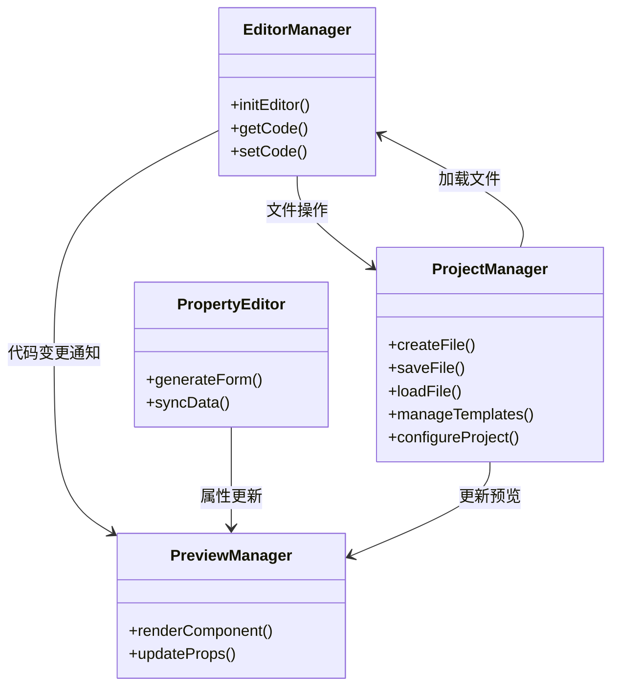
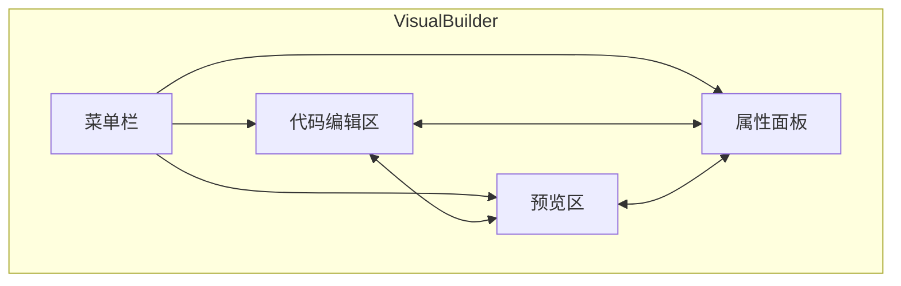

# VisualBuilder - Vue3组件高效开发工具

## 项目概述
VisualBuilder是一个专为Vue3组件开发设计的可视化开发工具，旨在提高前端组件开发效率。通过实时编辑和预览功能，开发者可以快速构建和调整Vue3组件。

## 核心功能

### 1. 界面布局
- **顶部菜单栏**：提供文件操作、保存、导出等基本功能
- **左侧代码编辑区**：支持Vue3单文件组件(SFC)语法高亮和智能提示
- **中间预览区**：实时渲染当前编辑的Vue组件
- **右侧属性面板**：可视化编辑组件props和data属性

### 2. 主要特性
- 实时双向绑定：代码修改即时反映在预览窗口
- 属性可视化编辑：无需手动修改代码即可调整组件属性
- 组件模板库：内置常用Vue3组件模板
- 导出功能：一键导出标准Vue3单文件组件

## 技术架构

### 前端技术栈
- **开发环境要求**：
  - Node.js v20+
  - npm v9+ 或 yarn v1.22+
  - 推荐使用nvm管理Node版本

## 详细设计

### 1. 模块划分
- **编辑器模块**：基于Monaco Editor的代码编辑功能
  - 代码补全：集成Vue3和TypeScript语言服务
  - 语法高亮：支持Vue SFC多语言块高亮
  - 代码格式化：集成Prettier自动格式化
  - 错误检查：实时语法和类型检查
  - 快捷键：支持VS Code风格快捷键

- **预览模块**：Vue3组件实时渲染引擎
  - 实现原理：通过动态创建iframe沙箱环境，使用Vue3的runtime-core实时编译和挂载组件
  - 安全机制：严格的内容安全策略(CSP)限制，禁用危险API
  - 热更新：基于WebSocket的增量更新，仅重新渲染变更部分
  - 错误隔离：沙箱环境捕获所有运行时错误，不影响主应用
  - 性能优化：组件缓存和复用机制

- **属性编辑模块**：动态表单生成器
  - 表单生成：根据组件props定义自动生成表单
  - 双向绑定：表单修改实时同步到代码
  - 类型支持：支持Vue3所有prop类型
  - 自定义控件：可扩展的表单控件库
  - 布局配置：支持灵活的表单布局

- **项目管理模块**：文件系统和项目配置管理
  - 文件操作：创建/打开/保存Vue组件
  - 模板管理：组件模板的导入/导出
  - 项目配置：Vite配置管理
  - 依赖管理：npm包依赖管理
  - 版本控制：集成Git基础功能

### 2. 关键类设计


### 3. 数据流
1. 系统初始化流程：
   - ProjectManager加载项目配置 → 初始化EditorManager/PreviewManager/PropertyEditor
   - ProjectManager加载模板库 → 提供给EditorManager使用

2. 文件操作流程：
   - 用户创建/打开文件 → ProjectManager → 加载内容到EditorManager → 初始化PreviewManager
   - 用户保存文件 → EditorManager → ProjectManager保存文件系统

3. 代码编辑流程：
   - 用户编辑代码 → EditorManager → 解析AST → 提取props → PropertyEditor
   - EditorManager → 实时同步代码到PreviewManager

4. 属性编辑流程：
   - 用户修改属性 → PropertyEditor → 生成新代码 → EditorManager → PreviewManager
   - PropertyEditor → 保存属性配置到ProjectManager

5. 模板应用流程：
   - 用户选择模板 → ProjectManager → 生成代码到EditorManager → 初始化PreviewManager

### 4. 核心算法
- **AST解析**：
  - 使用@vue/compiler-sfc解析Vue单文件组件
  - 提取template、script、style三部分
  - 分析script部分获取组件props定义
  - 构建组件属性元数据模型

- **双向绑定**：
  - WebSocket消息协议：
    ```json
    {
      "type": "code_update|prop_update",
      "data": "...",
      "timestamp": 1234567890
    }
    ```
  - 差分更新：仅同步变更部分
  - 冲突解决：基于时间戳的最终一致性

- **代码生成**：
  - 使用模板引擎生成Vue3组件代码
  - 支持props和data的响应式更新
  - 代码美化：集成Prettier统一代码风格
  - 源码映射：保持生成的代码可调试

- **模板处理**：
  - 模板语法分析：解析Vue模板指令
  - 动态插值：处理{{}}表达式
  - 组件引用：解析组件依赖关系

### 5. 关键接口定义
```typescript
// 编辑器接口
interface IEditor {
  getValue(): string
  setValue(code: string): void
  onDidChangeContent(listener: (e: any) => void): void
  formatCode(): Promise<void>
  getLanguageFeatures(): LanguageFeatures
}

// 预览器接口
interface IPreview {
  render(code: string): Promise<void>
  updateProps(props: Record<string, any>): void
  getComponentInstance(): ComponentPublicInstance | null
  captureError(error: Error): void
}

// 属性编辑器接口
interface IPropertyEditor {
  generateForm(schema: object): void
  getValues(): Record<string, any>
  setValues(values: Record<string, any>): void
  validate(): Promise<ValidationResult>
  reset(): void
}

// 项目管理接口
interface IProjectManager {
  createFile(template?: string): Promise<string>
  saveFile(path: string, content: string): Promise<void>
  loadFile(path: string): Promise<string>
  listTemplates(): Promise<TemplateInfo[]>
  applyTemplate(templateId: string): Promise<string>
  getProjectConfig(): ProjectConfig
  updateProjectConfig(config: Partial<ProjectConfig>): void
}

// 模板信息
interface TemplateInfo {
  id: string
  name: string
  description: string
  preview?: string
}

// 项目配置
interface ProjectConfig {
  vueVersion: string
  compilerOptions: Record<string, any>
  dependencies: Record<string, string>
  devDependencies: Record<string, string>
}

// 验证结果
interface ValidationResult {
  valid: boolean
  errors: ValidationError[]
}

// 语言特性
interface LanguageFeatures {
  completions: boolean
  diagnostics: boolean
  formatting: boolean
  hover: boolean
}
```

### 6. 错误处理机制
- **语法错误**：实时检测并高亮显示
- **运行时错误**：预览区显示错误堆栈
- **网络错误**：自动重连WebSocket
- **文件系统错误**：提供详细错误日志

### 7. 性能优化方案
- **代码分割**：按需加载编辑器组件
- **虚拟滚动**：处理大型组件模板
- **缓存策略**：AST解析结果缓存
- **懒加载**：延迟加载非核心功能模块

### 前端技术栈
- **框架**：Vue3 (v3.3+) + Vite (v4.0+)
- **编辑器**：Monaco Editor (v0.40+) - VS Code同款编辑器
- **UI库**：Element Plus (v2.3+) 
- **状态管理**：Pinia (v2.1+)
- **构建工具**：Vite (v4.0+)
- **代码格式化**：Prettier (v3.0+)
- **语法检查**：ESLint + Vue ESLint插件
- **CSS预处理器**：Sass (v1.60+)

### 后端技术栈
- **本地服务**：Node.js (v18+) + Express (v4.18+)
- **WebSocket**：ws (v8.13+) 实现实时预览功能
- **文件系统**：Node.js FS模块 + chokidar (v3.5+) 文件监听
- **进程管理**：PM2 (v5.3+) 生产环境部署
- **安全**：helmet (v7.0+) + csrf防护
- **日志**：winston (v3.8+) 日志记录

## 系统架构图



## 开发计划

### 第一阶段：基础功能开发 (1-2周)
- 搭建基础界面框架
- 实现代码编辑器与预览窗口基础联动
- 开发基本文件操作功能

### 第二阶段：核心功能开发 (2-3周)
- 实现属性面板与代码双向绑定
- 完善实时预览功能
- 添加组件模板库

### 第三阶段：优化与测试 (1周)
- 性能优化
- 用户体验改进
- 完整测试与bug修复

## 预期成果
- 一个完整的Vue3组件可视化开发工具
- 提高Vue3组件开发效率50%以上
- 支持标准Vue3组件导出，可直接用于生产环境
