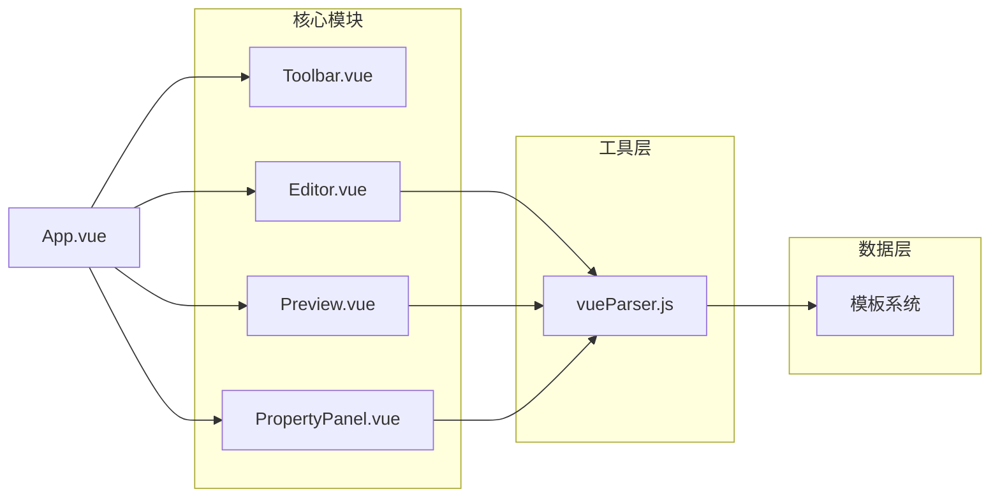
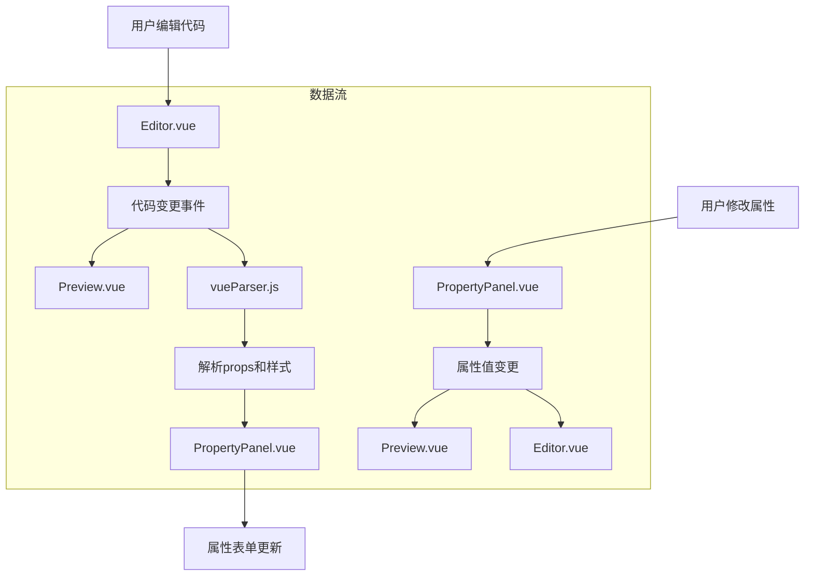

# VisualBuilder - Vue3组件高效开发工具

## 项目概述
VisualBuilder是一个专为Vue3组件开发设计的可视化开发工具，旨在提高前端组件开发效率。通过实时编辑和预览功能，开发者可以快速构建和调整Vue3组件。

## 核心功能

### 1. 界面布局
- **顶部工具栏**：提供文件操作、模板选择、导出等功能
- **左侧代码编辑区**：基于Monaco Editor的代码编辑器，支持Vue3单文件组件(SFC)语法高亮
- **中间预览区**：实时渲染当前编辑的Vue组件
- **右侧属性面板**：可视化编辑组件props和样式

### 2. 主要特性
- 实时预览：代码修改即时反映在预览窗口
- 属性可视化编辑：无需手动修改代码即可调整组件属性
- 样式可视化编辑：可视化配置组件样式
- 组件模板库：内置常用Vue3组件模板
- 导出功能：一键导出标准Vue3单文件组件

## 技术架构

### 前端技术栈
- **框架**：Vue3 (v3.5+) + Vite (v5.4+)
- **编辑器**：Monaco Editor (v0.52+) - VS Code同款编辑器
- **UI库**：Element Plus (v2.10+)
- **构建工具**：Vite (v5.4+)
- **代码解析**：@vue/compiler-sfc (v3.5+) 用于解析Vue单文件组件

### 开发环境要求
- Node.js v18+
- npm v9+ 或 yarn v1.22+
- 推荐使用nvm管理Node版本

## 项目结构

```
workspace/
├── src/
│   ├── components/
│   │   ├── Editor.vue          # 代码编辑器组件
│   │   ├── Preview.vue         # 组件预览组件
│   │   ├── PropertyPanel.vue   # 属性面板组件
│   │   └── Toolbar.vue         # 工具栏组件
│   ├── templates/
│   │   ├── default.js          # 默认模板
│   │   └── empty.js            # 空模板
│   ├── utils/
│   │   └── vueParser.js        # Vue组件解析工具
│   ├── App.vue                 # 主应用组件
│   └── main.js                 # 应用入口文件
├── package.json                # 项目依赖和脚本配置
└── vite.config.js              # Vite构建配置
```

## 核心组件

### 1. Editor.vue - 代码编辑器组件
- 基于 Monaco Editor 实现
- 支持 Vue3 单文件组件语法高亮
- 提供代码格式化功能
- 实时监听代码变更并通知其他组件

### 2. Preview.vue - 组件预览组件
- 使用 iframe 沙箱环境渲染 Vue 组件
- 实时更新预览内容
- 安全隔离，防止代码执行风险
- 支持组件属性和样式的实时更新

### 3. PropertyPanel.vue - 属性面板组件
- 可视化编辑组件 props
- 可视化编辑组件样式
- 支持多种 CSS 属性配置
- 动态表单生成，根据组件定义自动生成编辑表单

### 4. Toolbar.vue - 工具栏组件
- 提供文件操作功能（新建、打开、保存）
- 提供模板选择功能
- 提供导出 Vue 文件功能

## 核心工具

### vueParser.js - Vue组件解析工具
- `parseVueComponent(code)` - 解析 Vue 组件代码，提取 props 和样式
- `updateVueComponentStyles(originalCode, newStyles)` - 更新 Vue 组件样式
- `getBuiltinTemplates()` - 获取内置模板列表

## 使用说明

### 安装依赖
```bash
npm install
```

### 启动开发服务器
```bash
npm run dev
```

### 构建生产版本
```bash
npm run build
```

### 预览生产版本
```bash
npm run preview
```

## 功能详解

### 1. 代码编辑
- 左侧代码编辑区使用 Monaco Editor，提供完整的代码编辑体验
- 支持 Vue3 单文件组件语法高亮
- 实时将代码变更传递给预览组件和属性面板

### 2. 实时预览
- 中间预览区实时渲染当前编辑的 Vue 组件
- 使用 iframe 沙箱环境确保安全性
- 支持组件属性和样式的实时更新

### 3. 属性编辑
- 右侧属性面板提供可视化属性编辑
- 自动解析组件 props 并生成对应编辑控件
- 支持样式可视化编辑，提供常用的 CSS 属性配置

### 4. 模板系统
- 内置多种组件模板（基础组件、卡片组件、表单组件）
- 支持自定义模式，从空模板开始构建
- 一键应用模板，快速开始开发

### 5. 导出功能
- 支持将编辑的组件导出为标准 Vue 单文件组件
- 导出的组件可直接在其他 Vue 项目中使用

## 系统架构

VisualBuilder 采用前后端分离的架构设计，前端基于 Vue3 和 Vite 构建，后端暂未实现（计划中）。

### 前端架构图



### 数据流图



### 组件关系说明
- **App.vue**：主应用组件，协调各功能模块之间的数据传递
- **Editor.vue**：代码编辑器组件，基于 Monaco Editor 实现
- **Preview.vue**：组件预览组件，使用 iframe 沙箱环境渲染 Vue 组件
- **PropertyPanel.vue**：属性面板组件，提供可视化属性和样式编辑
- **Toolbar.vue**：工具栏组件，提供文件操作和模板选择功能
- **vueParser.js**：工具函数，负责解析 Vue 组件代码和处理样式

## 开发与贡献

### 项目结构说明
- `src/components/` - 核心功能组件
- `src/templates/` - 内置组件模板
- `src/utils/` - 工具函数
- `src/App.vue` - 主应用组件
- `src/main.js` - 应用入口文件

### 如何贡献
1. Fork 项目到自己的 GitHub 账户
2. 克隆项目到本地开发环境
3. 创建新的功能分支
4. 开发并测试新功能
5. 提交代码并推送至 GitHub
6. 创建 Pull Request

### 开发规范
- 遵循 Vue3 组合式 API 规范
- 使用 Element Plus 组件库
- 保持代码风格一致
- 添加必要的注释说明

## 未来规划

### 短期目标
- 完善属性面板功能，支持更多数据类型
- 优化预览性能，提升用户体验
- 增加更多内置组件模板

### 中期目标
- 实现后端服务，支持用户账户和项目保存
- 添加组件市场功能，支持第三方组件导入
- 增强样式编辑器功能，支持更复杂的样式配置

### 长期目标
- 打造完整的 Vue 组件开发生态系统
- 支持多种前端框架（React、Angular等）
- 提供团队协作功能
